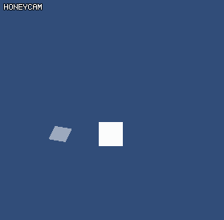

- Question : http://cafe.naver.com/unityhub/65717 (korean)



```csharp
using System.Collections;
using System.Collections.Generic;
using UnityEngine;
using UnityEngine.EventSystems;
using UnityEngine.UI;
public class Test : MonoBehaviour ,IDragHandler {
    float m_xMax;
    float m_xcen;
    public AnimationCurve curve= AnimationCurve.EaseInOut(0,0,1,1);
    private void Start()
    {
        m_xMax = GetComponent<RectTransform>().rect.xMax;
        m_xcen = transform.position.x;
    }
    
    public void OnDrag(PointerEventData eventData)
    {
        transform.position += new Vector3(eventData.delta.x, 0,0);
        for (int i = 0; i < transform.childCount; i++)
        {
            var child = transform.GetChild(i);
            var t = curve.Evaluate((-Mathf.Abs(child.position.x - m_xcen) + m_xMax) / m_xMax);
            child.transform.localScale = Vector3.one*Mathf.Lerp(0.5f, 1f, t);
            var color = child.GetComponent<Image>().color;
            color.a = Mathf.Lerp(0, 1, t);
            child.GetComponent<Image>().color = color;
            child.transform.rotation = Quaternion.Lerp(Quaternion.Euler(90, 45, 0), Quaternion.identity, t);
        }
    }
}
```
