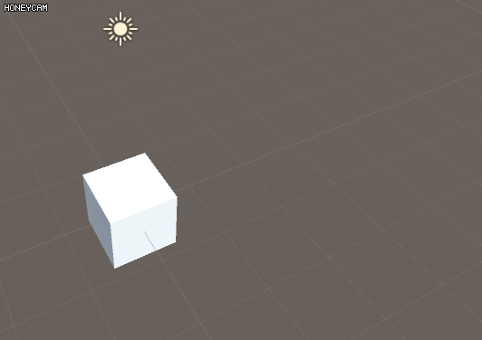
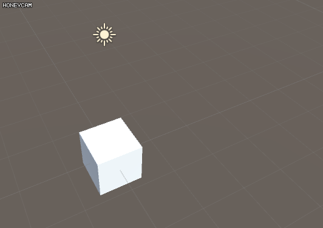
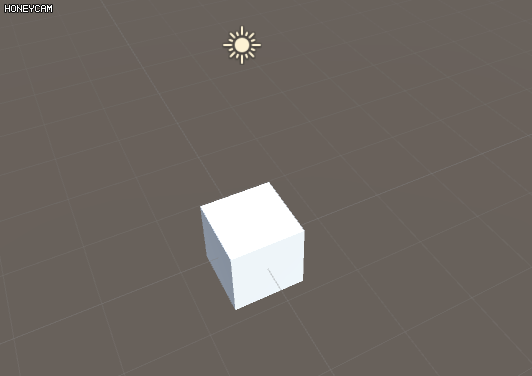

Vector3 Exmaples
=====
유니티에서 Vector3는 여러가지 용도로 사용됩니다. 하나하나 잘 알아두고 
transform.LookAt(direction); 이런식으로 사용하지 않도록 합니다.

## position
위치를 표현합니다. (10,-5,2) 라는 좌표가 있다면 x축으로 10, y축으로 -5, z축으로 2만큼 움직인 값입니다.
```csharp
private void Start()
{
    var position = new Vector3(1,1,1);
    transform.position = position;
}
```


## direction
방향을 표현합니다. 유니티에서는 (0,0,1)를 앞방향이라고 정의 되어 있습니다. transform.forward, transform.up, transform.right 등등 객체의 방향을 알 수 있는 프로퍼티들이 있습니다.
```csharp
private void Update()
{
    var direciton = new Vector3(0,1,0);
    transform.Translate(direction * Time.deltaTime);
}
```


## vector
벡터는 방향과 길이로 이루어져 있습니다. 이 벡터의 길이를 1로 만드는 것을 normalize라고 하며 길이 정보가 없어져 direction이 되게 됩니다. 
```csharp
private void Start()
{
    var vector = new Vector3(4,4,0);
    transform.Translate(vector);
}
```


## euler
각도를 표현할 때도 쓰입니다. 세가지 x축, y축, z축에 대하여 얼마나 회전되어 있는지를 표현합니다. Quaternion으로 변환해 주어야 rotation에 대입시킬 수 있습니다.
```csharp
private void Start()
{
    var euler = (0,45,0);
    transform.rotation = Quaternion.Euler(euler);
}
```


## axis
잘 사용되진 않습니다만 축을 표현할 때도 쓰입니다. (1,1,0)축은 x축과 y축 사이를 각각 45도 즉 반으로 가른 선을 축으로 나타내는 값입니다. 해당하는 축을 기준으로 회전시키는 예제입니다.
```csharp
private void Start()
{
    var axis = new Vector3(1,1,0);
    transform.Rotate(axis, Time.deltaTime*100);
}
```
